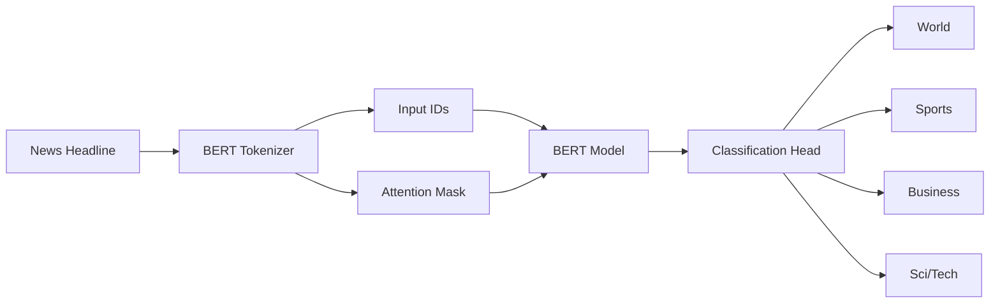
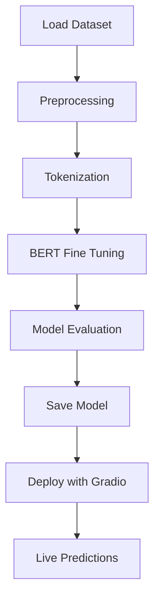

# 📰 BERT News Topic Classifier

### 🚀 Fine-Tuned Transformer for Automated News Categorization

<p align="center">
  
</p>

<p align="center">


</p>

---

# 🌟 Project Overview

This project leverages the power of **BERT (Bidirectional Encoder Representations from Transformers)** to automatically classify news headlines into four categories:

| Label | Category |
| ----- | -------- |
| 🌍 0  | World    |
| ⚽ 1   | Sports   |
| 💹 2  | Business |
| 🔬 3  | Sci/Tech |

The model is fine-tuned using the **AG News Dataset** and deployed through **Gradio** for real-time predictions.

---

# 🎯 Problem Statement

Thousands of news articles are published every minute.

Manual categorization is:

❌ Slow

❌ Expensive

❌ Error-Prone

This project automates the process using state-of-the-art Transformer architecture.

---

# 🏗️ System Architecture



---

# 🔥 Key Features

✅ Fine-Tuned BERT Model

✅ Transfer Learning

✅ Hugging Face Transformers

✅ AG News Dataset

✅ Real-Time Gradio Deployment

✅ Accuracy & F1 Evaluation

✅ Multi-Class Classification

✅ Production Ready Structure

---

# 🛠️ Tech Stack

```text
Programming Language
│
├── Python
│
Machine Learning
│
├── PyTorch
├── Transformers
├── Datasets
└── Scikit-Learn
│
Deployment
│
└── Gradio
│
Visualization
│
├── Pandas
└── Matplotlib
```

---

# 📂 Project Structure

```bash
BERT-News-Classifier/
│
├── notebook/
│   └── news_classifier.ipynb
│
├── bert_ag_news/
│   ├── config.json
│   ├── tokenizer.json
│   ├── vocab.txt
│   └── pytorch_model.bin
│
├── screenshots/
│   ├── prediction.png
│   ├── confusion_matrix.png
│   └── training_curves.png
│
├── requirements.txt
│
└── README.md
```

---

# 🔄 Machine Learning Workflow



---

# 📊 Dataset Information

### AG News Dataset

| Property         | Value   |
| ---------------- | ------- |
| Classes          | 4       |
| Total Samples    | 127,600 |
| Training Samples | 120,000 |
| Testing Samples  | 7,600   |
| Language         | English |

---

# 📈 Dataset Distribution

```text
World      ████████████████████████ 30,000
Sports     ████████████████████████ 30,000
Business   ████████████████████████ 30,000
Sci/Tech   ████████████████████████ 30,000
```

Balanced dataset → Better training performance.

---

# 🧠 Why BERT?

Traditional ML Models:

❌ Limited Context

❌ Poor Semantic Understanding

❌ Manual Feature Engineering

BERT:

✅ Context-Aware

✅ Bidirectional Learning

✅ Transfer Learning

✅ State-of-the-Art NLP Performance

---

# 🚀 Training Configuration

```python
Model               : bert-base-uncased
Epochs              : 3
Batch Size          : 16
Max Length          : 128
Optimizer           : AdamW
Evaluation Metric   : Accuracy + F1 Score
Framework           : Hugging Face Trainer
```
